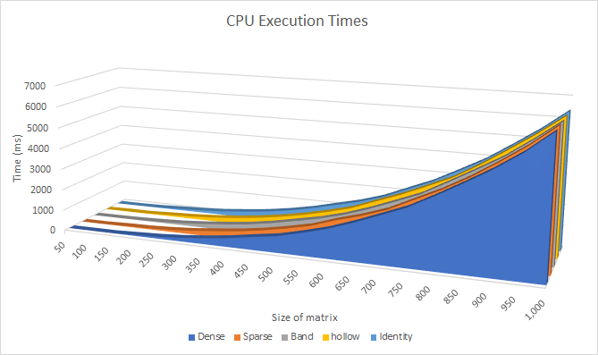
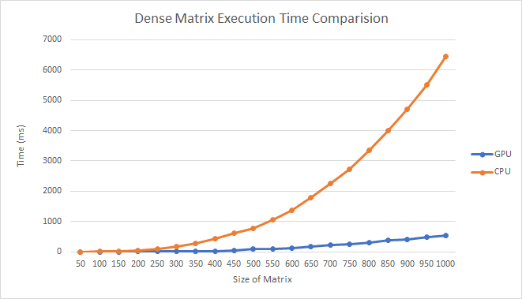
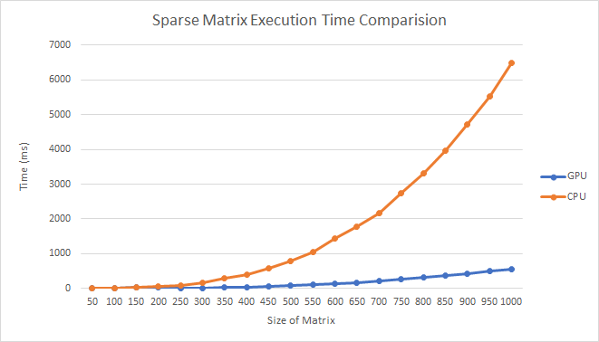
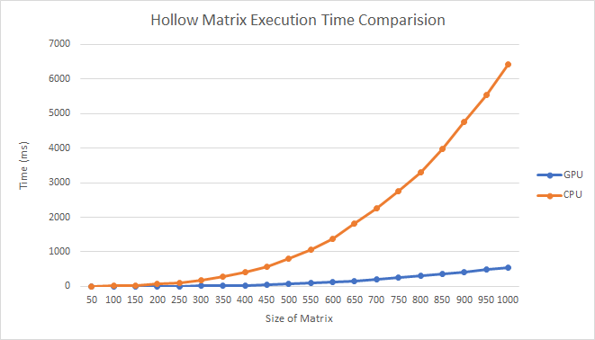
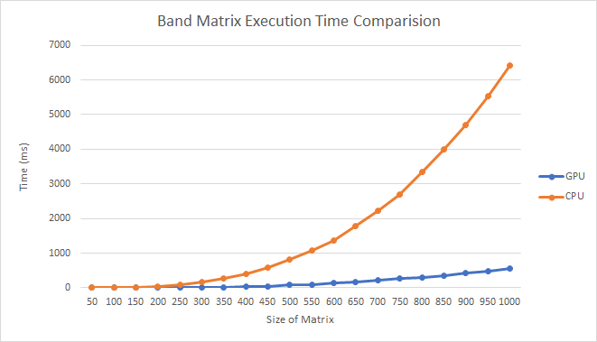
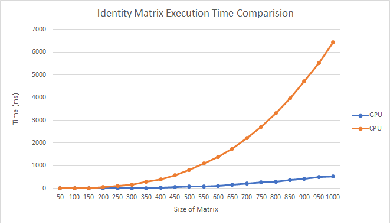

# Implementation of Gauss Jordan matrix inversion on GPU

This repository aims to implement the algorithm stated in <a href='https://www.sciencedirect.com/science/article/pii/S0045794913002095'> this research paper </a>

## Steps to reproduce results

Inputs have not been uploaded to GitHub due to it's size. Inputs can be generated by running the following:
```
python3 .\input_generator.py
```

#### CUDA Implementation 
Make sure to have cuDNN 9.0 and the CUDA Toolkit 10.0 (or any other CUDA Toolkit version compatible with Nvidia GTX1060 GPU)

```
nvcc .\Gauss_Jordan_inversion_gpu.cu -o gpu.exe 
.\gpu.exe
```

#### CPU Implementation 

```
g++ .\Gauss_Jordan_inversion_cpu.cpp -o cpu.exe
\.cpu.exe filename size_of_matrix
```

For retrieving multiple results of the CPU implemetation, make the executable and then run the python script. 
```
python3 .\cpu_results_getter.py
```

## Results


#### CPU Execution Time 


#### GPU Execution Time 


#### GPU vs CPU Execution Time for Dense Matrix 


#### GPU vs CPU Execution Time for Sparse Matrix 


#### GPU vs CPU Execution Time for Hollow Matrix 


#### GPU vs CPU Execution Time for Band Matrix 


#### GPU vs CPU Execution Time for Identity Matrix 



